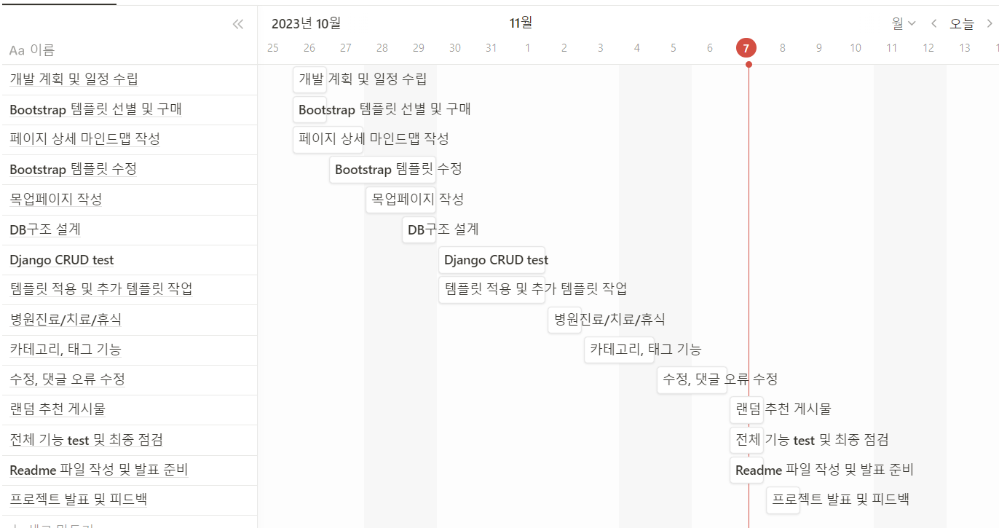
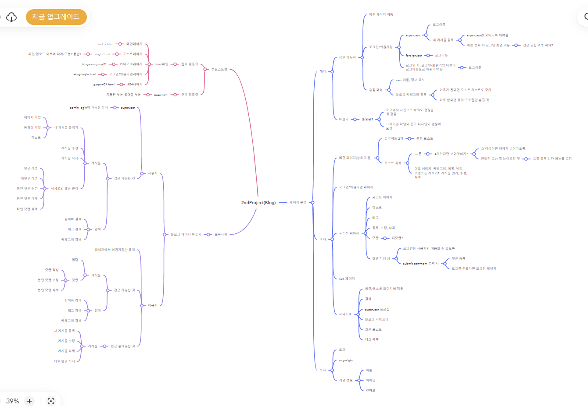
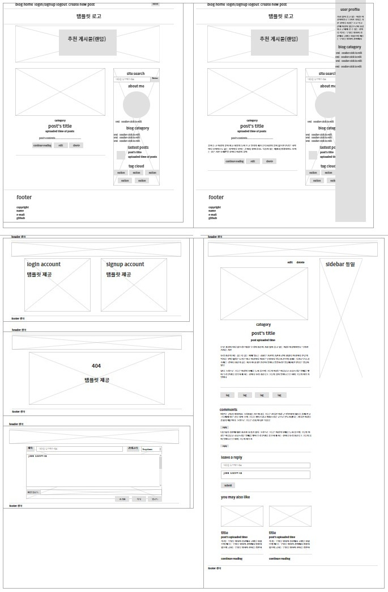
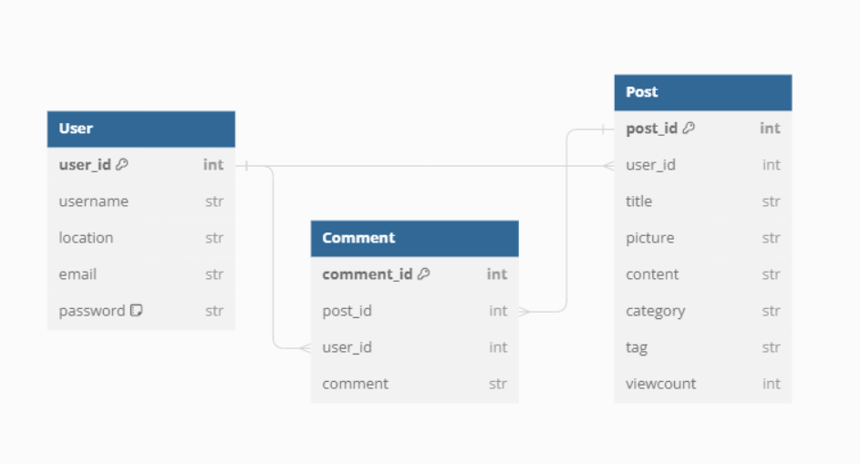

# 2ndProject_Blog

# 오르미 3기 두번째 개인 프로젝트: 블로그 개설하기

## 1. 목표와 기능
### 1.1 목표
- 게시물에 대한 기본적인 CRUD 만들기
- 부트스트랩 활용
### 1.2 기능
- 로그인/회원가입 관리
- 게시물 업로드 및 게시물 수정, 삭제 기능
- 블로그 페이지에서 회원가입한 사용자한에서 댓글 작성 기능

## 2. 개발 일정(WBS)
- 노션 타임라인
  

## 3. 개발 환경 및 배포 URL
### 3.1 개발환경

## 3. 프로젝트 구조
### 3.1 마인드맵
- Mindmeister 링크: https://www.mindmeister.com/app/map/3010878011
  

### 3.2 목업 페이지
- https://ovenapp.io/project/DGY1dyEDCSxTVnsAE2LIKQ6MthNyu223#9i42R
  

### 3.3 DB 구조
- https://dbdiagram.io/d/my_blog-653ef688ffbf5169f0b04b3a
  

### 3.4 트리 구조

📦my_blog
 ┣ 📂accounts
 ┃ ┣ 📂migrations
 ┃ ┣ 📂__pycache__
 ┃ ┣ 📜admin.py
 ┃ ┣ 📜apps.py
 ┃ ┣ 📜forms.py
 ┃ ┣ 📜models.py
 ┃ ┣ 📜tests.py
 ┃ ┣ 📜urls.py
 ┃ ┣ 📜views.py
 ┃ ┗ 📜__init__.py
 ┣ 📂blog
 ┃ ┣ 📂migrations
 ┃ ┣ 📂__pycache__
 ┃ ┣ 📜admin.py
 ┃ ┣ 📜apps.py
 ┃ ┣ 📜forms.py
 ┃ ┣ 📜models.py
 ┃ ┣ 📜tests.py
 ┃ ┣ 📜urls.py
 ┃ ┣ 📜views.py
 ┃ ┗ 📜__init__.py
 ┣ 📂media
 ┃ ┗ 📂blog
 ┃ ┃ ┣ 📂files/ 📂2023/📂11/📂07
 ┃ ┃ ┃ ┣ 📜KakaoTalk_20231107_015356387.mp4
 ┃ ┃ ┃ ┗ 📜KakaoTalk_20231107_015356387_iIFWm6S.mp4
 ┃ ┃ ┗ 📂images/ 📂2023/📂11/📂07
 ┃ ┃ ┃ ┣ 📜KakaoTalk_20231107_015352688.jpg
 ┃ ┃ ┃ ┣ 📜KakaoTalk_20231107_015352688_01.jpg
 ┃ ┃ ┃ ┣ 📜KakaoTalk_20231107_015352688_01_bFGD3iF.jpg
 ┃ ┃ ┃ ┣ 📜KakaoTalk_20231107_015352688_enzs8fp.jpg
 ┃ ┃ ┃ ┗ 📜KakaoTalk_20231107_015352688_G9Q9kKK.jpg
 ┣ 📂static
 ┃ ┣ 📂css
 ┃ ┃ ┣ 📜.DS_Store
 ┃ ┃ ┣ 📜animate.css
 ┃ ┃ ┣ 📜animate.min.css
 ┃ ┃ ┣ 📜bootstrap.css
 ┃ ┃ ┣ 📜bootstrap.css.map
 ┃ ┃ ┣ 📜bootstrap.min.css
 ┃ ┃ ┣ 📜bootstrap.min.css.map
 ┃ ┃ ┣ 📜font-awesome.css
 ┃ ┃ ┣ 📜font-awesome.min.css
 ┃ ┃ ┗ 📜style.css
 ┃ ┣ 📂fonts
 ┃ ┃ ┣ 📜fontawesome-webfont.eot
 ┃ ┃ ┣ 📜fontawesome-webfont.svg
 ┃ ┃ ┣ 📜fontawesome-webfont.ttf
 ┃ ┃ ┣ 📜fontawesome-webfont.woff
 ┃ ┃ ┣ 📜fontawesome-webfont.woff2
 ┃ ┃ ┗ 📜FontAwesome.otf
 ┃ ┣ 📂images
 ┃ ┃ ┣ 📜apple-touch-icon.png
 ┃ ┃ ┣ 📜close.png
 ┃ ┃ ┣ 📜favicon.ico
 ┃ ┃ ┣ 📜flogo.png
 ┃ ┃ ┣ 📜loader.gif
 ┃ ┃ ┣ 📜loading.gif
 ┃ ┃ ┣ 📜logo.png
 ┃ ┃ ┣ 📜logo.psd
 ┃ ┃ ┣ 📜logo@2x.png
 ┃ ┃ ┣ 📜next.png
 ┃ ┃ ┣ 📜prev.png
 ┃ ┃ ┗ 📜white-logo.png
 ┃ ┣ 📂js
 ┃ ┃ ┣ 📜bootstrap.js
 ┃ ┃ ┣ 📜bootstrap.min.js
 ┃ ┃ ┣ 📜custom.js
 ┃ ┃ ┣ 📜jquery.min.js
 ┃ ┃ ┗ 📜tether.min.js
 ┣ 📂templates
 ┃ ┣ 📂accounts
 ┃ ┃ ┣ 📜login.html
 ┃ ┃ ┗ 📜signup.html
 ┃ ┣ 📂blog
 ┃ ┃ ┣ 📜page-404.html
 ┃ ┃ ┣ 📜post_confirm_delete.html
 ┃ ┃ ┣ 📜post_detail.html
 ┃ ┃ ┣ 📜post_list.html
 ┃ ┃ ┗ 📜post_new.html
 ┃ ┗ 📜base.html
 ┣ 📂tutorialdjango
 ┃ ┣ 📂__pycache__
 ┃ ┣ 📜asgi.py
 ┃ ┣ 📜settings.py
 ┃ ┣ 📜urls.py
 ┃ ┣ 📜wsgi.py
 ┃ ┗ 📜__init__.py
 ┣ 📜db.sqlite3
 ┣ 📜manage.py
 ┗ 📜requirements.txt

## 4. UI
### 4.1 상세설명 gif
-

## 5. 개발 중 발생한 문제점
<ol>
    <li>
    <li>
    <li>
    <li>
    <li>
</ol>

## 6. 후기
-