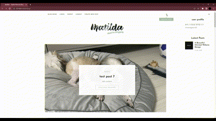
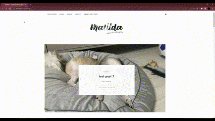
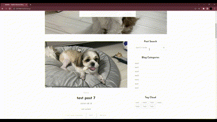
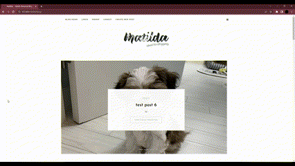

# 2ndProject_Blog

# 오르미 3기 두번째 개인 프로젝트: 블로그 개설하기

## 1. 목표와 기능
### 1.1 목표
- 게시물에 대한 기본적인 CRUD 만들기
- 부트스트랩 활용
### 1.2 기능
- 로그인/회원가입 관리
- 게시물 업로드, 게시물 수정, 삭제 및 댓글 기능

## 2. 개발 일정(WBS)
- 노션 타임라인
<br><br>


## 3. 개발 환경
### 3.1 개발환경


## 3. 프로젝트 구조
### 3.1 트리 구조
```
📦my_blog
 ┣ 📂accounts
 ┃ ┣ 📂migrations
 ┃ ┣ 📂__pycache__
 ┃ ┣ 📜admin.py
 ┃ ┣ 📜apps.py
 ┃ ┣ 📜forms.py
 ┃ ┣ 📜models.py
 ┃ ┣ 📜tests.py
 ┃ ┣ 📜urls.py
 ┃ ┣ 📜views.py
 ┃ ┗ 📜__init__.py
 ┣ 📂blog
 ┃ ┣ 📂migrations
 ┃ ┣ 📂__pycache__
 ┃ ┣ 📜admin.py
 ┃ ┣ 📜apps.py
 ┃ ┣ 📜forms.py
 ┃ ┣ 📜models.py
 ┃ ┣ 📜tests.py
 ┃ ┣ 📜urls.py
 ┃ ┣ 📜views.py
 ┃ ┗ 📜__init__.py
 ┣ 📂media
 ┃ ┗ 📂blog
 ┃ ┃ ┣ 📂files
 ┃ ┃ ┗ 📂images
 ┣ 📂static
 ┃ ┣ 📂css
 ┃ ┣ 📂fonts
 ┃ ┣ 📂images
 ┃ ┣ 📂js
 ┣ 📂templates
 ┃ ┣ 📂accounts
 ┃ ┃ ┣ 📜login.html
 ┃ ┃ ┗ 📜signup.html
 ┃ ┣ 📂blog
 ┃ ┃ ┣ 📜page-404.html
 ┃ ┃ ┣ 📜post_confirm_delete.html
 ┃ ┃ ┣ 📜post_detail.html
 ┃ ┃ ┣ 📜post_list.html
 ┃ ┃ ┗ 📜post_new.html
 ┃ ┗ 📜base.html
 ┣ 📂tutorialdjango
 ┃ ┣ 📂__pycache__
 ┃ ┣ 📜asgi.py
 ┃ ┣ 📜settings.py
 ┃ ┣ 📜urls.py
 ┃ ┣ 📜wsgi.py
 ┃ ┗ 📜__init__.py
 ┣ 📜db.sqlite3
 ┣ 📜manage.py
 ┗ 📜requirements.txt
```
### 3.2 마인드맵
- Mindmeister 링크: https://www.mindmeister.com/app/map/3010878011
<br><br>


### 3.3 목업 페이지
- https://ovenapp.io/project/DGY1dyEDCSxTVnsAE2LIKQ6MthNyu223#9i42R
<br><br>


### 3.4 DB 구조
- https://dbdiagram.io/d/my_blog-653ef688ffbf5169f0b04b3a
<br><br>


## 4. UI
## 4.1 블로그 메인
### 4.1.1
<br>

<br>

- 반응형웹으로 웹과 모바일 환경 맞춰 제공합니다.
- 상하단의 로고, 마틸다(템플릿 저작권자의 로고)를 클릭하면 블로그 메인, 화면 상단으로 이동합니다.

### 4.1.2 블로그 상단 메뉴바
<br>
<br>

- 블로그 상단의 'Blog Home', 'Login', 'Signup', 'Logout', 'Create New Post'를 클릭하여 블로그 메인 화면, 로그인 및 회원가입, 새 게시물 작성이 가능합니다.

<br>
<br>
<br>

- 'signup' 페이지에서 간단하게 회원가입을 할 수 있으며, 메인 화면 우측 상단의 숨김 메뉴에서 유저명을 확인 할 수 있으며, 로그아웃 시 우측 숨김 메뉴에서 유저 정보가 사라집니다.

### 4.1.3 게시물 3개를 랜덤으로 슬라이드
<br>

- 메인 화면 로고 하단에, 업로드한 게시물 중 3개를 랜덤으로 보여줍니다. 
- 썸네일 이미지와 카테고리, 타이틀을 확인할 수 있으며, 상세 게시물을 확인하기 위해서는 슬라이드 가운데의 'continue reading'을 클릭하시면 상세 게시물로 이동합니다.

### 4.1.4 업로드한 게시물 목록 확인과 게시물 검색
<br>
- 메인 화면에서 게시물 검색, 카테고리, 태그로 특정 게시물에 접근할 수 있습니다.

## 4.2 게시물 CRUD
### 4.2.1 Create
<br>

- 상단 메뉴의 'Create New Post'를 통해 새 게시물을 작성할 수 있습니다.

<br>

- 단, 등록된 superuser가 아니라면 게시물에 대한 접근을 할 수 없습니다.

### 4.2.2 Read
<br>

- 메인 화면에서 'continue reading' 버튼을 통해 상세 게시물에 접근이 가능합니다.
- 게시물 썸네일 이미지 상단에는 열람 시 조회수를 확인할 수 있으며, superuser한에서 수정, 삭제가 가능하며, 목록으로 메인 화면으로 돌아갑니다.

### 4.2.3 Update(Edit)
<br>

- 등록된 superuser만 게시물 수정이 가능합니다.

### 4.2.4 Delete
<br>
<br>

- 게시물 삭제의 경우 삭제 의사를 한 번 더 확인하는 페이지로 연결되어 삭제 과정을 진행하도록 하였습니다.

### 4.2.5 댓글
<br>

- superuser, 일반 user 모두 게시물에 댓글을 달 수 있습니다.

## 5. 후기
- Bootstrap + Django 였음에도 불구하고 개발 속도가 느렸으며, 구현 실력이 부족하여 템플릿을 대거 삭제하는 일이 발생하였습니다.
- 초기 계획했던 상세 게시물 페이지 하단의 추천 게시물 표시와 유저별 최근 열람한 게시물을 상단의 숨김 메뉴에서 볼 수 있도록 하는 기능을 구현하지 못하였습니다.
- 에러에 대한 대처가 미흡하였으며, 발생했던 에러를 따로 기록하였다면 같은 에러 발생 시 더 빠른 대처를 할 수 있었지 않았나 생각이듭니다.
- 구현에 실패한, 대댓글 달기, 유저별 열람한 게시물 숨김 메뉴에 표시, 제공된 템플릿의 UI를 다 적용하지 못한 점 등 스스로 미흡한 부분을 많이 알 수 있었습니다.